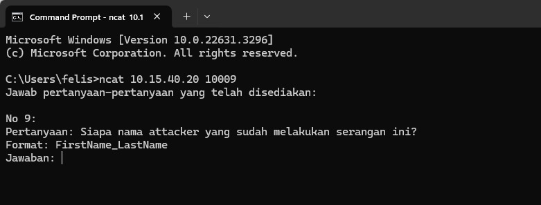
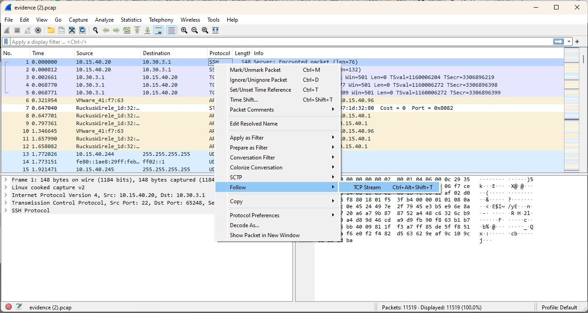
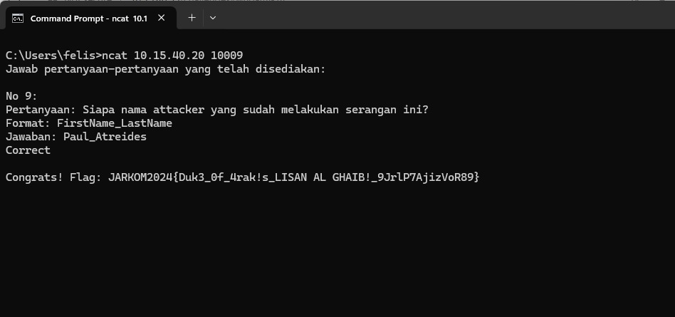
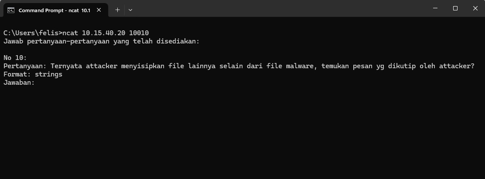
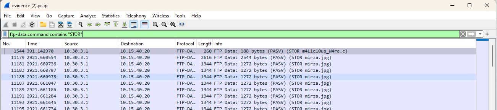
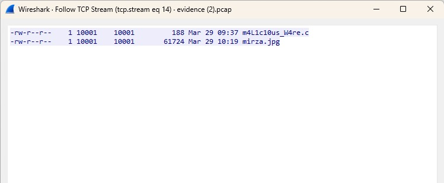
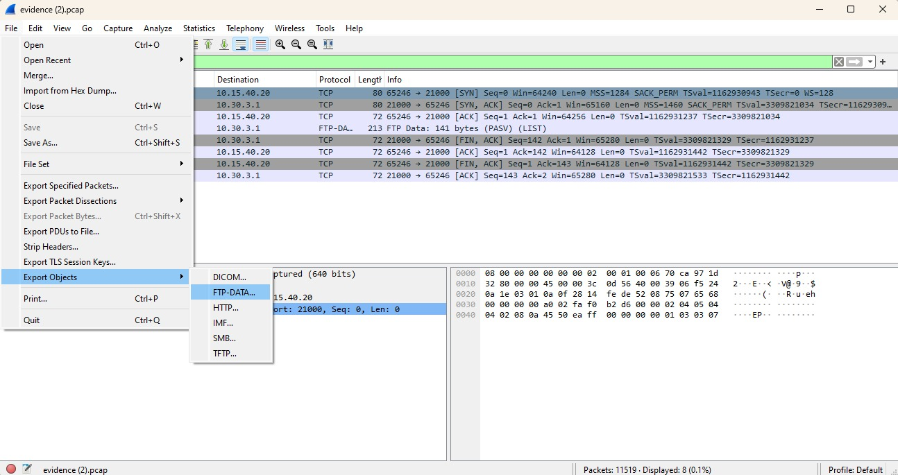
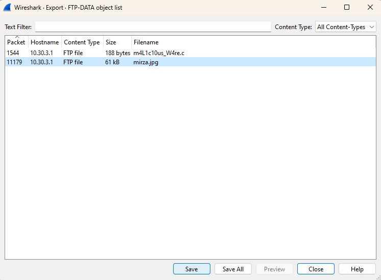
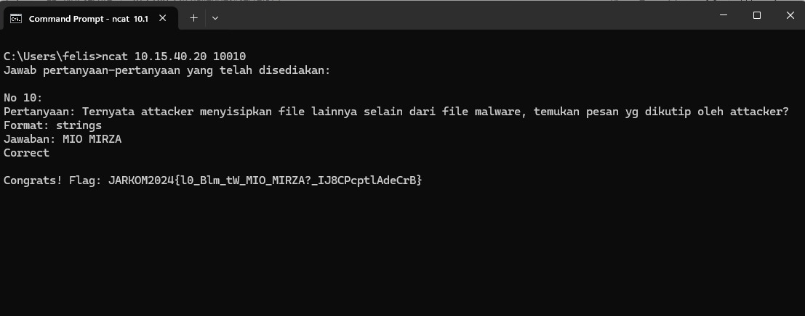

# Jarkom-Modul-1-IT23-2024

| Nama | NRP |
| ---- | ---- |
| Etha Felisya BR Purba | 5027221017 |
| Rahmad Aji Wicaksono | 5027221034 |

## Challenges
  - [Creds] 
  - [ATM or ATP or FTP ? 🤔] 
  - [whoami] 
  - [malwleowleo] 
  - [How Many packets?] 
  - [trace him] 
  - [evidence] 
  - [fuzz] 
  - [secret] 
  - [malwaew] 

## Challenges Completion
### whoami
Dapatkah kamu menemukan siapa identitas attacker?
1. Buka cmd dan input command **ncat 10.15.40.20 10009** maka soalnya akan muncul seperti dibawah

2. Buka attachment yang sama dengan yang ada pada soal creds, dan follow TCP Stream

3. Saya menemukan string seperti berikut

4. Setelah string tersebut didecode ditemukan pesan seperti dibawah

5. Masukkan nama attacker sesuai dengan format yang diminta dan flag dapat diperoleh

### secret
Temukan pesan rahasia dari attacker
1. Buka cmd dan input command **ncat 10.15.40.20 10010** maka soalnya akan muncul seperti dibawah

2. Gunakan filter STOR untuk memfokuskan pada aktivitas pengiriman file dalam koneksi FTP.

