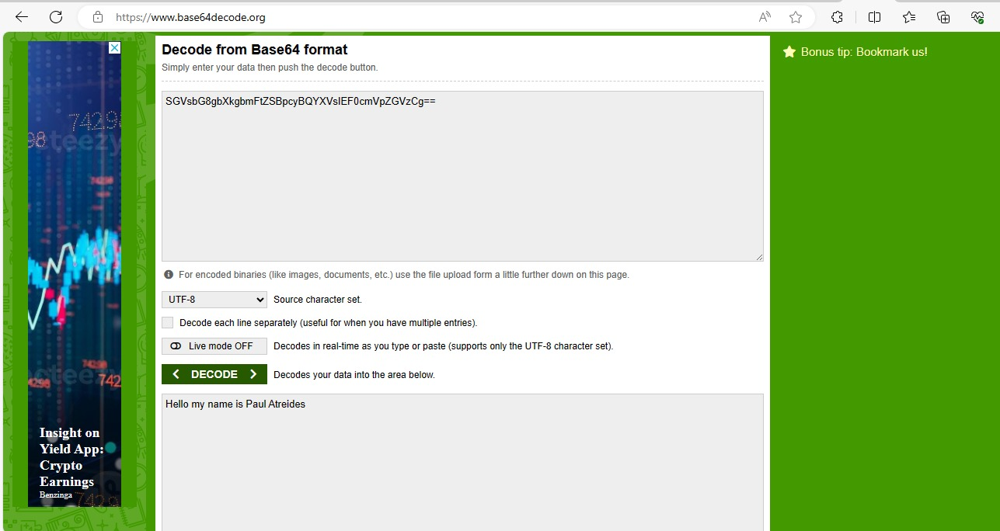
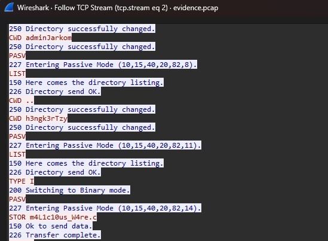

# Jarkom-Modul-1-IT23-2024

| Nama | NRP |
| ---- | ---- |
| Etha Felisya Br Purba | 5027221017 |
| Rahmad Aji Wicaksono | 5027221034 |

## Challenges
  - [Creds] 
  - [ATM or ATP or FTP ? 🤔] 
  - [whoami] 
  - [malwleowleo] 
  - [How Many packets?] 
  - [trace him] 
  - [evidence] 
  - [fuzz] 
  - [secret] 
  - [malwaew] 

## Challenges Completion

### ! creds
> Attacker menyadari jika dia bisa membuat clone ftp server dari target, temukan kredensial dari server ftp yang dibuat oleh attacker.

Langkah:
  1. Masukkan **nc 10.15.40.20 10007**
  2. Apa username ftp yang digunakan oleh attacker?
     hal pertama yang terpikirkan adalah memfilter dengan filter **tcp.len>0** yang langsung menampilkan hanya paket yang ada isinya.
     pada beberapa paket sudah ketemu username ftp yang digunakan oleh attacker.
     
  3. Apa password ftp yang digunakan oleh attacker?
     hal pertama yang saya lakukan yaitu melakukan **follow TCP Stream** pada paket yang berisi kredensial username.
     melihat isi stream ke 2 langsung ketemu password ftp yang digunakan oleh attacker.
     
  4. Setelah menjawab beberapa pertanyaan tersebut flag berhasil didapatkan.
     

### ! ATM or ATP or FTP ? 🤔
> Pradityo mencoba mengembangkan server ftp, tetapi seseorang mencoba melakukan bruteforce login, bisakah anda menganalisis apa yang terjadi?

Langkah:
  1. Masukkan **nc 10.15.40.20 10004**
  2. Apa password yang berhasil didapatkan oleh hacker setelah melakukan bruteforce login ftp?
     filter yang saya gunakan pertama yaitu **tcp.len>0** kemudian mencari dengan filter **frame contains "Login"**.
     setelah itu scroll kebawah hingga menemukan login successful.
     
  3. Setelah menjawab pertanyaan tersebut flag akan didapatkan.
     

### whoami
Dapatkah kamu menemukan siapa identitas attacker?
1. Buka cmd dan input command **ncat 10.15.40.20 10009** maka soalnya akan muncul seperti dibawah

2. Buka attachment yang sama dengan yang ada pada soal creds, dan follow TCP Stream

3. Saya menemukan string seperti berikut

4. Setelah string tersebut didecode ditemukan pesan seperti dibawah

5. Masukkan nama attacker sesuai dengan format yang diminta dan flag dapat diperoleh

### ! malwleowleo
> Dapatkah kamu menemukan file malware yang dikirim oleh attacker melalui ftp?

Langkah:
  1. Masukkan **nc 10.15.40.20 10008**
  2. Apa nama malware yang dikirim oleh attacker ke korban?
     hal yang terlintas pertama yaitu langsung melakukan **follow TCP Stream** ke salah satu paket yang berisi kredensial attacker.
     kemudian menganalisis apa saja yang dilakukan oleh attacker setelah berhasil login dan ketemu ternyata attacker melakukan perintah **STOR** file malware.
     
  3. Setelah menjawab pertanyaan tersebut flag berhasil didapatkan.
     

### ! How Many packets?
> Sebagai kewajiban untuk laporan, aku diminta untuk mencari tahu berapa kali attempt login yang dilakukan oleh hacker. Dapatkah kamu membantuku untuk menganalisanya?

Langkah:
  1. Masukkan **nc 10.15.40.20 10005**
  2. Berapa total attempt login(bruteforce) yang dilakukan oleh hacker?
     filter yang terpikirkan pertama yaitu **frame contains "Login"** yang kemudian akan menampilkan total paket yang berisi string "Login".
     setelah itu terdapat total 933 upaya login gagal dan 1 login berhasil sehingga 934 login.
     
  3. Setelah menjawab pertanyaan tersebut flag berhasil didapatkan.
     

### ! trace him
> Selain menghitung jumlah packet, coba lacak juga ip penyerang tersebut!

Langkah:
  1. Masukkan **nc 10.15.40.20 10006**
  2. Alamat IP attacker?
     hal pertama yang terlintas di pikiran saya yaitu langsung mengecek ip source.
     kemudian ip attacker berhasil didapatkan.
     
  3. Setelah menjawab pertanyaan tersebut flag berhasil didapatkan.
     

### ! evidence
> Perusahaan nanomate baru saja kebobolan. Mereka menyewamu untuk mencari tahu bagaimana caranya pelaku bisa masuk.

Langkah:
  1. Masukkan **nc 10.15.40.20 10002**
  2. Apa domain milik korban?
     hal pertama yang saya lakukan yaitu memfilter dengan **tcp.len>0** untuk memfilter hanya paket yang ada isinya yang ditampilkan.
     kemudian dalam beberapa paket terdapat isi berupa domain perusahaan milik korban.
     
  3. Apa web server yang digunakan oleh korban?
     saya langsung melakukan **follow HTTP Stream** pada salah satu paket.
     kemudian menganalisa stream sehingga menemukan web server yang digunakan.
     
  4. Apa endpoint yang digunakan untuk login sebagai user biasa?
     saya menerapkan filter **frame contains "POST"** untuk menampilkan hanya paket HTTP dan memiliki isi.
     kemudian saya melakukan analisa terhadap paket-paket tersebut dan menemukan paket yang berisi endpoint tersebut.
     
  5. Apa email dan password yang berhasil digunakan untuk login sebagai user biasa?
     filter yang terlintas langsung **frame contains "Successful"**.
     kemudian melakukan **follow HTTP Stream** dan menemukan kredensial email:password.
     
  6. Setelah menjawab beberapa pertanyaan tersebut flag berhasil didapatkan.
     
     

### ! fuzz
> My website got hacked. Can you analyze this network traffic to help me track the attacker?

Langkah:
  1. Apa IP address milik attacker?
     hal pertama yaitu melihat IP source dari traffic network.
     ip attacker pun berhasil didapatkan.
     
  2. Apa port yang digunakan sebagai web server korban?
     sama seperti langkah 1 yaitu menganalisis beberapa paket sebelum melakukan filter.
     sehingga didapatkan port yang digunakan.
     
  3. Apa endpoint yang digunakan untuk login?
     hal pertama yang saya lakukan yaitu langsung **follow HTTP Stream** ke salah satu paket.
     kemudian melakukan analisa yang mendapatkan path=/.
     
  4. Apa tool yang digunakan oleh attacker untuk bruteforce login?
     saat menganalisis HTTP Stream saya mendapatkan informasi user-agent bernama Fuzz Faster U Fool v2.0.0-dev.
     kemudian saya mencari di google terkait Fuzz dan menemukan singkatan yang sesuai dengan format yaitu **ffuf**.
     
  5. Apa username dan password yang berhasil digunakan oleh attacker?
     filter pertama yang terpikirkan yaitu **frame contains "302 Found"**.
     
     karena filter tersebut tidak secara langsung memberikan hasil, saya melakukan **follow HTTP Stream** pada paket tersebut sehingga didapatkan Stream 1.
     
     kemudian saya melakukan pencarian dengan memasukkan 302 Found dan mendapatkan kredensial yang berhasil.
     
  6. Setelah menjawab beberapa pertanyaan tersebut flag berhasil didapatkan.
     
     

### secret
Temukan pesan rahasia dari attacker
1. Buka cmd dan input command **ncat 10.15.40.20 10010** maka soalnya akan muncul seperti dibawah

2. Gunakan filter STOR untuk memfokuskan pada aktivitas pengiriman file dalam koneksi FTP.

Selain malicious file pada pertanyaan sebelumnya, ditemukan juga mirza.jpg

3. Download file tersebut dengan cara klik file dan export objects dan pilih FTP DATA

kemudian klik file mirza.jpg dan save

4. Buka file yang telah di download dan pesan ditemukan

5. Masukkan pesan ke cmd dan flag diperoleh

